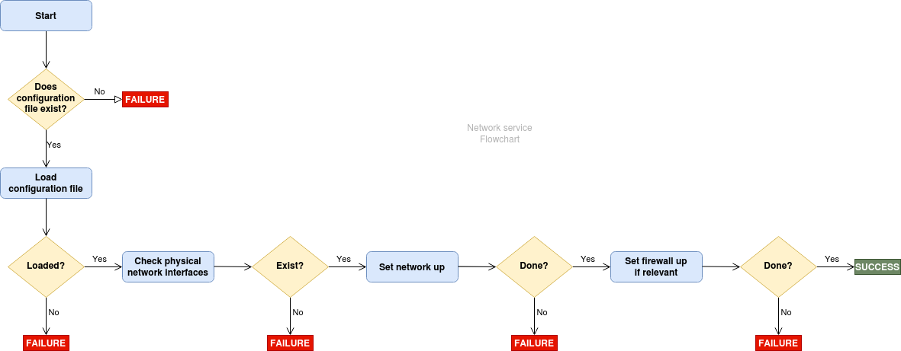
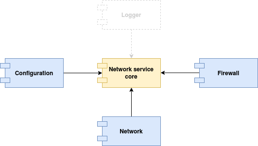
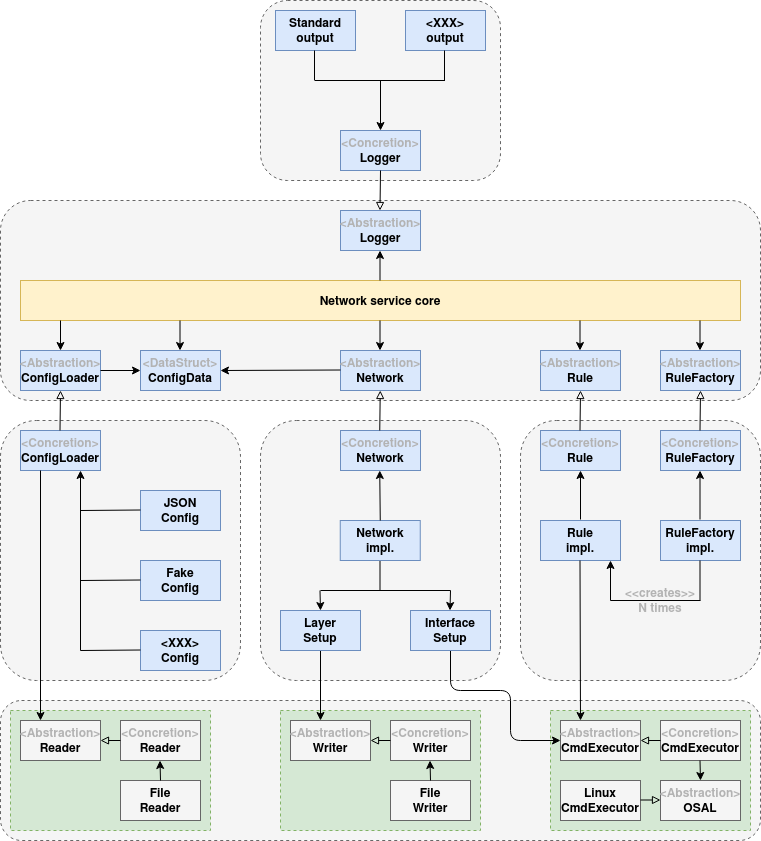

# NetworkService

[](https://github.com/BoubacarDiene/NetworkService/blob/master/LICENSE.md)
[](
https://travis-ci.org/BoubacarDiene/NetworkService)
[](http://BoubacarDiene.github.io/NetworkService)
[](https://coveralls.io/github/BoubacarDiene/NetworkService?branch=master)


<a href="https://scan.coverity.com/projects/boubacardiene-networkservice">
  
</a>

# Table of Contents
- [Description](#description)
- [Goals](#goals)
- [Software design](#software-design)
  - [Flowchart](#flowchart)
  - [Components](#components)
  - [Details](#details)
- [Code quality](#code-quality)
  - [Documentation](#documentation)
  - [Compilation options](#compilation-options)
    - [Address sanitizer](#address-sanitizer)
    - [Security flags](#security-flags)
  - [Include What You Use](#include-what-you-use)
  - [Link What You Use](#link-what-you-use)
  - [Code formatting](#code-formatting)
  - [Static analysis and code linting](#static-analysis-and-code-linting)
  - [Dependency graph](#dependency-graph)
  - [Unit testing](#unit-testing)
  - [Code coverage](#code-coverage)
    - [Remote: coveralls](#remote-coveralls)
    - [Local: gcovr](#local-gcovr)
  - [Git hook](#git-hook)
- [Installation](#installation)
  - [Development](#development)
    - [Build in debug mode](#build-in-debug-mode)
    - [Run unit tests](#run-unit-tests)
    - [Generate code coverage](#generate-code-coverage)
    - [Generate dependency graph](#generate-dependency-graph)
    - [Generate documentation](#generate-documentation)
    - [Run code formatting](#run-code-formatting)
    - [Run static analysis](#run-static-analysis)
    - [Run analysis](#run-analysis)
    - [Start the application](#start-the-application)
  - [Release](#release)
    - [Build in release mode](#build-in-release-mode)
    - [Start the application](#start-the-application)
- [Third-party dependencies](#third-party-dependencies)

## Description

NetworkService is an easy-to-use C++17 project that aims at executing network-related commands more securely by relying on tools such as: ip, iptables, ebtables, nftables, a custom network tool, etc. It won't change your everyday life but for developers and entreprises working on systems that need to communicate with the rest of the world through a network, a service like this could be very useful.

By studying the source code carefully, you might tell yourself this project is just *many lines of code* to take a configuration file as input then perform several fork+exec and write to some network-related files. That's indeed what it roughly does but one must remember that the goal of professional software development is not just making softwares work.

Thus, NetworkService has been designed and developed so that best practices in software design and object-oriented programming, code quality and also [secure programming](http://shop.oreilly.com/product/9780596003944.do) have been taken into consideration. *At least, I tried somehow:-)*. Let me know if something could be improved; *One never stops learning*.

**Why creating a native service for that purpose instead of directly using needed tools?** Yes, there are other means but none met my objectives due to licensing or security issue, a need for a correct architecture, etc. Here is a non exhaustive overview:
+ Calling commands one by one in a bash script
+ Using successive system() calls
+ Statically or dynamically linking with used tools' libraries (when available)

## Goals
Usually, I develop all my personal softwares in C language. One reason to that is because it is one of the programming languages I'm most comfortable with. This time, I needed to practice a recent version of the C++ language, a widely used programming language which I've not used much even if I understand it quite well.

However, using C++17 is not the only purpose of this project. Indeed, I had time so I decided to set up many of the steps that I think are essential in a *software development process*, always starting with the software design.

I do not consider that the most important in this project is the final software, which can obviously be useful, but all that made it possible to produce it: design, used tools, continuous integration, automatic checks of programming errors, applied good practices, etc.

## Software design

### Flowchart
<p align="center">

</p>

The above flowchart is a simplified graphical view of what the service should do. Once a valid configuration file is provided, it is parsed and loaded into memory to get the full list of network and firewall commands to execute. It is not mandatory to provide firewall commands. Indeed, the service can be used to only configure network interfaces: set ip addresses, add network interfaces, update routing tables, etc.

Firewall commands can allow to monitor incoming and outgoing traffic to a network interface and filter it according to user-defined rules. A rule can simply be something like: "Reject UDP packets coming from IP address 10.0.0.1/8".

Note that, when firewall rules are provided, network commands have to be executed first so that network interfaces are correctly configured before use.

### Components
From the flowchart, one can at least extract three components:
- **Configuration**: To load the configuration file
- **Network**: To check that physical interfaces to be used exist and execute network commands
- **Firewall**: To configure firewall by executing rules

<p align="center">

</p>

Logger component has been added to allow logging messages that can help debugging the service when necessary, inform about interesting operations it is doing, etc. The Network service core organizes how components work together to perform actions.

### Details
<p align="center">

</p>

The core service only depends on (stable) abstractions. It is not supposed to change a lot as it has no knowledge of low level details. These are handled by other components which are kind of plugins from the service's point of view. *Reader*, *Writer* and *Command executor* are underlying helper classes to improve maintainability, ... and ease executing commands.

Note that extending the service is easy. It consists in adding new code (*see <XXX>*); no update of existing code should be necessary.

## Code quality
Concretely, several tools have been used to reach the level of quality expected in this project. Most of them are automatically enabled when generating a debug version of the software.

It's easy to forget to manually run tools/build targets that check for conformance with expected code quality. Therefore, automating these checks becomes a no brainer. That's what is done in this project (See [.travis.yml](.travis.yml)). Thus, when new pull requests are proposed, following checks are performed by continuous integration tool:
- Checks to ensure that there is no whitespace
- Checks to ensure that doxygen comments are correctly written
- Checks to ensure that code formatting is correct
- Checks to ensure that static analysis/linting returns no error
- Checks to ensure that the software compiles in all configurations
- etc.

Automating things that are better handled by tools is a good habit to take because developers can then focus on what really brings a value-added for the entreprise.

### Documentation
[Doxygen](http://www.doxygen.nl/) has been used to document classes and, more generally, all header files that composed the project, and generate the documentation. The resulting documentation, which has been generated based on [Doxyfile](doc/Doxyfile.in) can be browsed [**online**](https://boubacardiene.github.io/NetworkService/).

### Compilation options
The GCC compiler comes with several interesting compilation flags (See [compilation-options.cmake](cmake/compilation-options.cmake) for more details on those used in this project) and [GCC options](http://man7.org/linux/man-pages/man1/gcc.1.html) to understand their meanings.

#### Address sanitizer
Address sanitizer aka ASAN is a memory error detector for C/C++. As described in [this link](https://github.com/google/sanitizers/wiki/AddressSanitizer), it allows to detect errors such as: buffer overflow, use after free, etc.

For more details, see ENABLE_ASAN in [compilation-options.cmake](cmake/compilation-options.cmake).

#### Security flags
Several compilation options can be used to help [harden](https://wiki.debian.org/Hardening) a resulting binary against memory corruption attacks, or provide additional warning messages during compilation. That helps producing a secure software protected against many known security vulnerabilities with no real effort.

For more details, see ENABLE_SECU in [compilation-options.cmake](cmake/compilation-options.cmake).

### Include What You Use
[Include What You Use](https://include-what-you-use.org/) aka IWYU is a tool that checks all header and source files to make sure "#include"-ed files are really used. It may be particularly useful when, for example, you've reworked some source files and would like to know if all "#include" inside are still necessary.

However, note that IWYU can be a bit verbose due to the fact that it expects for each source file to explicitly include all header files it uses. Consider A.h which includes B.h, if Main.cpp includes A.h but also uses functions in B.h, IWYU will warn because a #include "B.h" is not found in Main.cpp. Also, the tool sometimes recommends using some system's internal headers instead of their public versions. Besides, it often tries to enforce the use of forward declarations which can certainly speed up the build time but must be used **intelligently** (See [Forward declarations: pros vs cons](https://google.github.io/styleguide/cppguide.html#Forward_Declarations) for the pros and cons of using forward declaration).

For all reasons described above, I decided to not apply all its recommendations and to not enable it by default even in debug mode. For more details, see ENABLE_IWYU in [compilation-options.cmake](cmake/compilation-options.cmake).

### Link What You Use
Link What You Use aka LWYU means what the name suggests: it's about ensuring that the only linked libraries are those really used by the software. It consists in adding the linker flag *"-Wl,--no-as-needed"* and run the command *"ldd -r -u"* on the generated executable.

From [ld manual page](https://linux.die.net/man/1/ld): *"Normally the linker will add a DT_NEEDED tag for each dynamic library mentioned on the command line, regardless of whether the library is actually needed or not. --as-needed causes a DT_NEEDED tag to only be emitted for a library that satisfies an undefined symbol reference from a regular object file or, if the library is not found in the DT_NEEDED lists of other libraries linked up to that point, an undefined symbol reference from another dynamic library. **--no-as-needed** restores the default behaviour."*.

For more details, see ENABLE_LWYU in [compilation-options.cmake](cmake/compilation-options.cmake).

### Code formatting
Code formatting is a useful way to keep source code consistent regarding look and feel. Developers that already have performed code reviewing on [gerrit](https://www.gerritcodereview.com/) for example will probably agree that there's nothing worse than being forced to focus on formatting/styling issues instead of using that time to review what's really important: the content, the architecture. Clearly, that should never happen.

In this project, code formatting can be done automatically thanks to [Git hook](#git-hook) or manually using ```make clang-format``` command. Formatting is also automatically checked by continuous integration tool when submitting a new commit.

For more details, see [Clang Format](https://clang.llvm.org/docs/ClangFormat.html) and the [.clang-format](.clang-format) configuration file.

### Static analysis and code linting
Static analysis is a set of processes for finding source code defects and vulnerabilities. In static analysis, the code under examination is not executed.

On the other hand, [Code linters](https://en.wikipedia.org/wiki/Lint_(software)) are usually defined as style-checkers tools but they can also behave as basic static code analyzers.

There are a wide variety of static analysis tools ([clang-tidy](https://clang.llvm.org/extra/clang-tidy/), [Cppcheck](http://cppcheck.sourceforge.net/), [Coverity Scan](https://scan.coverity.com/), etc.). Some like Clang-Tidy can be configured to have both roles: linter and static analyzer.

**Which one is better?** I believe that each can report errors others did not find so ideally, better use more than one. This project started with Clang-Tidy based on [.clang-tidy](.clang-tidy) configuration file. However, Coverity Scan and maybe more will be added afterward.

### Dependency graph
[Wikipedia](https://en.wikipedia.org/wiki/Dependency_graph) defines it as *"a directed graph representing dependencies of several objects towards each other"*. I use [Graphviz](https://www.graphviz.org/) to generate the dependency graph which shows how the different CMake's build targets I've defined are related to each other. Here is the result:

<p align="center">

</p>

A dependency graph is extremely important when it comes to finding whether or not there are dependency cycles in the software design. A dependency cycle occurs when for example a software component A &#8594; B &#8594; C &#8594; D &#8594; B (&#8594; meaning "depends on"). Suppose that each software component is under a specific team's responsibility. In this example, Team A can't release a new version of its component without ensuring that B, the direct component it depends on, is compatible. As B depends on C, Team A must also do the same for C and so on with D, with B again which must be compatible with D, etc. Thus, simply testing component A requires too many checks.

It should always be possible for a team to work on its side, publishing new releases whenever it wants, integrating other teams' releases whenever it wants, without being much impacted by changes in components the team should not depend on. In previous example, a change in component B may force D to make some updates which in turn require changes in C, then in B and so on. Imagine nightly builds that fail in loop just because each team is at the mercy of the other.

Hope it's clear **there must never be cycles in a software architecture**. It doesn't matter if it's component (*developer's responsibility*) or system level (*architect's responsibility*).

### Unit testing
Unit testing is a level of software testing whose purpose is to validate that each *small piece* of the software aka *System Under Test* performs as designed. It absolutely **does not guarantee that the software is free of bugs**; just that it does things one expected it to do.

It's not necessary to come back on properties a good unit test should have. I would just insist on one important point: *Do not wait until writing unit tests before asking yourself if your system is testable or not*. **Testability** has to be taken into account when designing the system.

**Who write unit tests for a specific component?** The usual answer is *the developer who wrote that component*. However, developers sometimes tend to write tests to make them work with the code they have already written. I mean when they made mistakes in their code, they can involuntarily write wrong unit tests instead of making them reveal those mistakes. For this reason, an expert in [*functional safety*](https://www.synopsys.com/automotive/what-is-iso-26262.html) told me one day that *the developer who wrote the unit under test should not be responsible for writing the corresponding unit tests*. I think it makes sense.

GoogleTest and GoogleMock frameworks have been used to write unit tests in this project. You can find tests [**here**](test).

### Code coverage
[Wikipedia](https://en.wikipedia.org/wiki/Code_coverage) defines it quite well: *"In computer science, test coverage is a measure used to describe the degree to which the source code of a program is executed when a particular test suite runs. A program with high test coverage, measured as a percentage, has had more of its source code executed during testing, which suggests it has a lower chance of containing undetected software bugs compared to a program with low test coverage."*.

#### Remote: coveralls
Code coverage results are available [**online**](https://coveralls.io/github/BoubacarDiene/NetworkService?branch=master). Unit tests are automatically built and launched by continuous integration tool which then sends the coverage to coveralls.io.

#### Local: gcovr
It may be interesting to also generate test coverage locally on development machine so that one can get an idea before submitting any change. A ```make coverage``` command has been added to generate the report. After a successful ```make install```, open *"out/share/coverage/index.html"* with your favorite browser to see the report.

### Git hook
[Git hooks](https://githooks.com/) are scripts that Git executes before or after events such as: commit, push. Git hooks can be very useful for identifying certain issues before a new change is submitted to code review. Pointing these issues out before code review has the huge advantage of allowing code reviewers to focus on the content, the architecture of the change thus avoiding to waste time with issues relative to style, formatting, trailing whitespaces, etc.

Performing quality-related checks on the whole software (static analysis, code formatting, linting, ...) takes time mainly due to Clang's analyzer. Also, it's not a good idea to rely on developers to manually run those checks before any commit. Manual actions can sometimes be unintentionnaly forgotten.

For these reasons, a [pre-commit](cmake/git/pre-commit-hook.in) hook has been added to this project to make some **checks on changed files only**. It is automatically installed into hooks directory; no manual action is required.

The pre-commit hook is executed on "git commit" action. It verifies trailing whitespaces, fixes code formatting and runs the static analyzer on staged files. As it currently needs version 10 of clang-format and clang-tidy, you have to [**installed**](https://apt.llvm.org/) these tools on your host machine if you want to fully take benefit from the hook.

## Installation
Everything needed to build and test this project is provided in [Dockerfile](ci/Dockerfile). Before moving to next sections, first generate the docker image:
```
git clone https://github.com/BoubacarDiene/NetworkService.git [-b <version>] && cd NetworkService
docker build -t networkservice-image ci/
```

All commands in next sections have to be run inside docker container. Here is how to start the container:
```
docker run --privileged -it -u $(id -u) --rm -v $(pwd):/workdir networkservice-image:latest
```

### Development

#### Build in debug mode
```
mkdir -p build && cd build
cmake .. -DCMAKE_INSTALL_PREFIX=./out -DCMAKE_BUILD_TYPE=Debug -DENABLE_UNIT_TESTING=ON
make && make install
```

**Note:** You can add ```-DCONFIG_LOADER=fake``` to CMake options if you want to use the fake version of the config loader. I added it to develop the software without caring about how the configuration will be provided to the service (JSON, YAML, SQL, etc.).

#### Run unit tests
```
ctest -V
```

#### Generate code coverage
```
make coverage && make install
```

**Notes:**
- Make sure to run coverage command after unit tests (```ctest -V``` command) and before [starting the application](#start-the-application)
- The index.html file can then be found at *"out/share/coverage/index.html"*

#### Generate dependency graph
```
make dependency-graph && make install
```

**Note:** The resulting graph can then be found at *"out/share/dependency-graph"*

#### Generate documentation
```
make doc && make install
```

**Notes:**
- The index.html file can then be found at *"out/share/doc/html/index.html"*
- If the command fails, more details can be found at *"doc/doxygen_warnings.txt"*

#### Run code formatting
```
make clang-format
```

#### Run static analysis
```
make clang-tidy
```

#### Run analysis
```
make analysis
```

**Notes:**
- This command takes time due to Clang's analyzer
- It automatically performs following actions:
  - Generate code coverage as done [here](#generate-code-coverage)
  - Generate dependency graph as done [here](#generate-dependency-graph)
  - Apply code formatting to source and test files as done [here](#run-code-formatting)
  - Run static analysis as done [here](#run-static-analysis)

#### Start the application
```
out/bin/networkservice -c ../res/example.json

or

valgrind out/bin/networkservice -c ../res/example.json
```

**Note:** Obviously, *res/example.json* file is just a sample configuration file to test the software and show how to write config files.

### Release

#### Build in release mode
```
mkdir -p build && cd build
cmake .. -DCMAKE_INSTALL_PREFIX=./out -DCMAKE_BUILD_TYPE=Release -DENABLE_UNIT_TESTING=OFF
make && make install
```

#### Start the application
```
out/bin/networkservice -c ../res/example.json
```

### Third-party dependencies
  - [**CLI11**](https://github.com/CLIUtils/CLI11): Parse command line options (Header-only)
  - [**nlohmann/json**](https://github.com/nlohmann/json): Parse configuration file (Header-only)
  - [**GTest/GMock**](https://github.com/google/googletest): Unit testing and mocking
